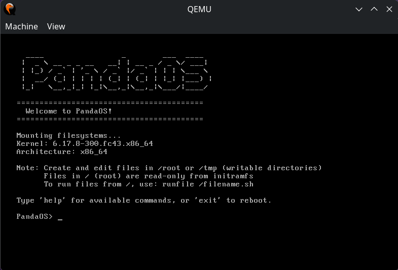
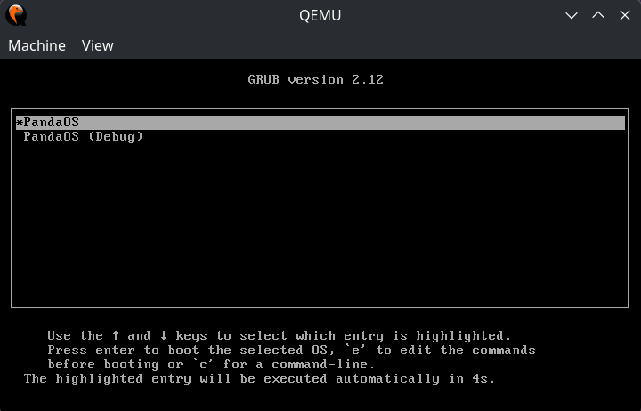
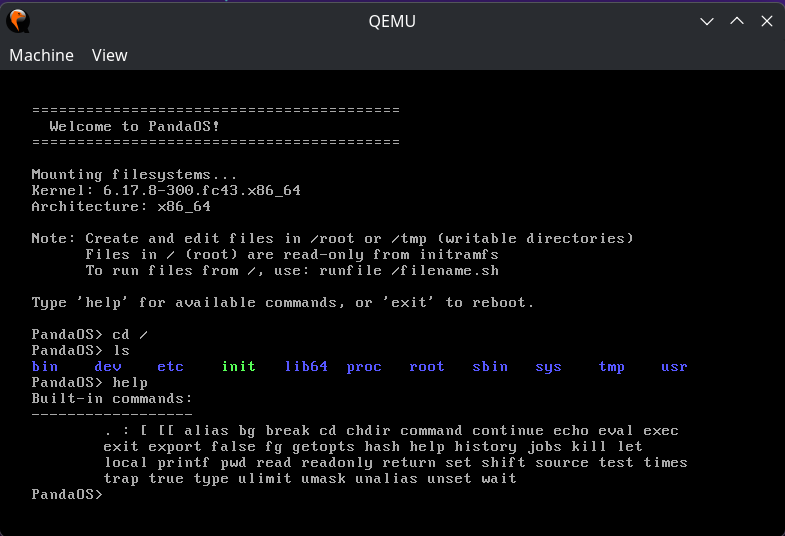
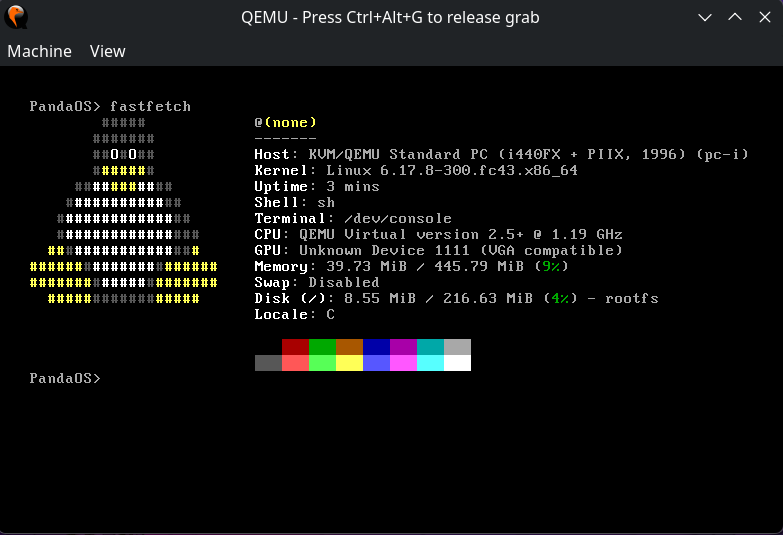
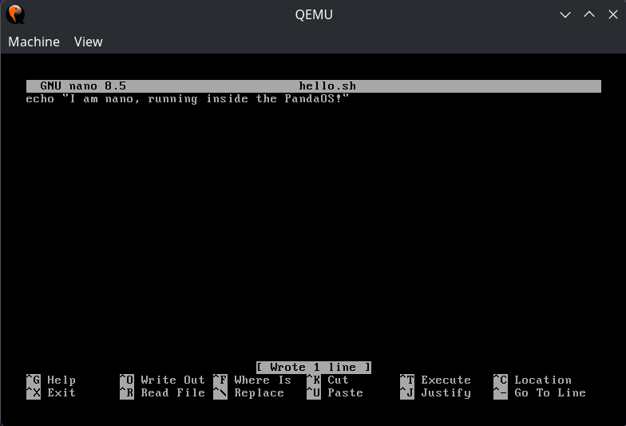
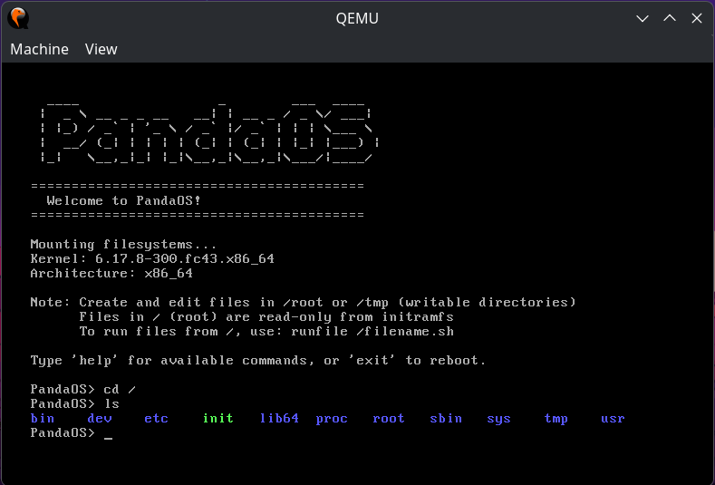
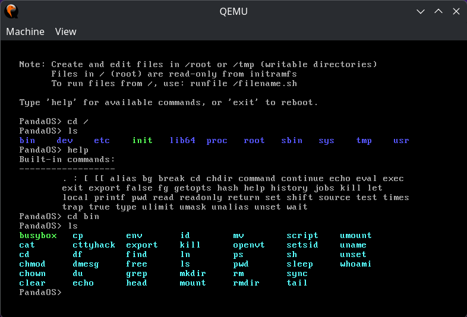

# PandaOS

Just another linux kernel based hobby OS of mine!

## Screenshots

<div align="center">

### 🐼 Hero Screenshot



### 📸 Gallery

<table>
  <tr>
    <td align="center">
      
      <br />
      <strong>GRUB Boot Menu</strong>
    </td>
    <td align="center">
      
      <br />
      <strong>Help Command</strong>
    </td>
  </tr>
  <tr>
    <td align="center">
      
      <br />
      <strong>Fastfetch System Info</strong>
    </td>
    <td align="center">
      
      <br />
      <strong>Nano Text Editor</strong>
    </td>
  </tr>
  <tr>
    <td align="center">
      
      <br />
      <strong>Root Directory Listing</strong>
    </td>
    <td align="center">
      
      <br />
      <strong>Bin Directory Listing</strong>
    </td>
  </tr>
</table>

</div>

## Overview

PandaOS is a minimal Linux-based operating system. It provides a basic shell environment for experimentation and learning. It's my kinda hobby project, just experimenting - nothing serious. [MOON]

## Project Structure

```
PandaOS/
├── kernel/          # TinyCore Linux kernel (vmlinuz)
├── rootfs/          # Root filesystem structure
│   └── init        # Init script
├── boot/            # Bootloader configuration
│   └── grub/       # GRUB configuration
├── iso/             # Build output directory
└── build.sh         # Build scrip
```

## Requirements

To build PandaOS, you'll need:

- `bash`
- `grub-mkrescue` or `xorriso` (for creating ISO)
- `cpio` and `gzip` (for initramfs)
- `busybox` (recommended, for basic utilities)

On Fedora/RHEL:
```bash
sudo dnf install grub2-tools xorriso cpio gzip busybox
```

## Building

1. Make the build script executable:
```bash
chmod +x build.sh
```

2. Run the build script:
```bash
./build.sh
```

This will create a bootable ISO image named `pandaos-YYYYMMDD.iso` in the project root.

## Booting

You can boot the ISO using:

- **QEMU/KVM:**
```bash
qemu-system-x86_64 -cdrom pandaos-YYYYMMDD.iso -m 512M
```

- **VirtualBox/VMware:** Create a new VM and boot from the ISO

## Features

- 🐼 **Custom ASCII Art** - Beautiful panda art on boot
- 🛠️ **Minimal Init System** - Lightweight and fast
- 💻 **Basic Shell Environment** - BusyBox-based shell with essential utilities
- 📝 **Nano Text Editor** - Full-featured text editor included
- 📊 **Fastfetch** - System information display tool
- 🔧 **Mounted Filesystems** - proc, sys, and dev filesystems ready
- 📁 **Writable Directories** - /root and /tmp for file operations

## Customization

- Edit `rootfs/init` to customize the boot process
- Modify `boot/grub/grub.cfg` to change boot options
- Add more utilities to the initramfs in `build.sh`
- Replace `kernel/vmlinuz` with any Linux kernel
